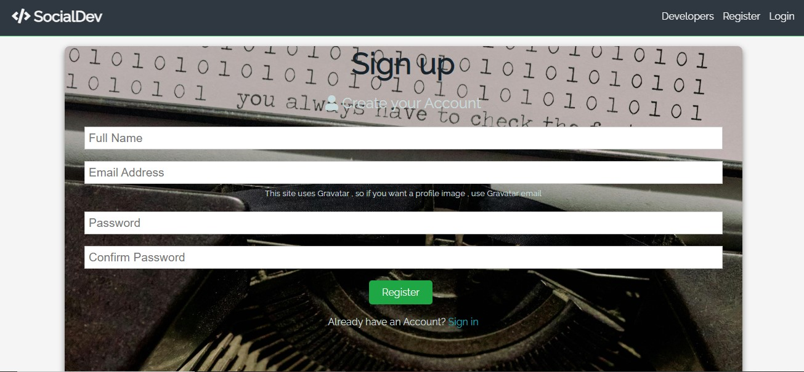
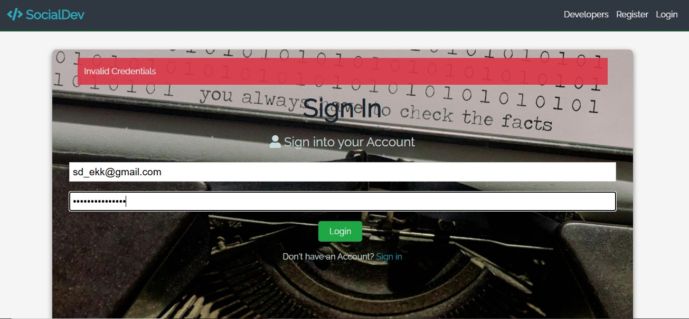
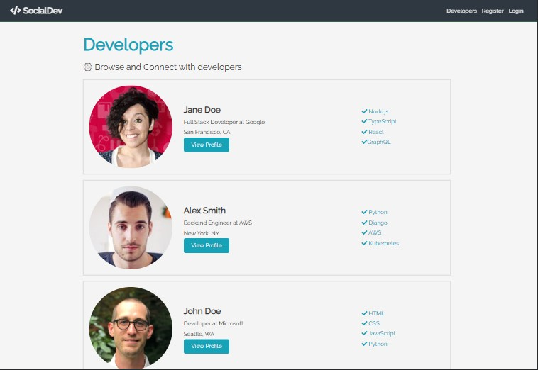
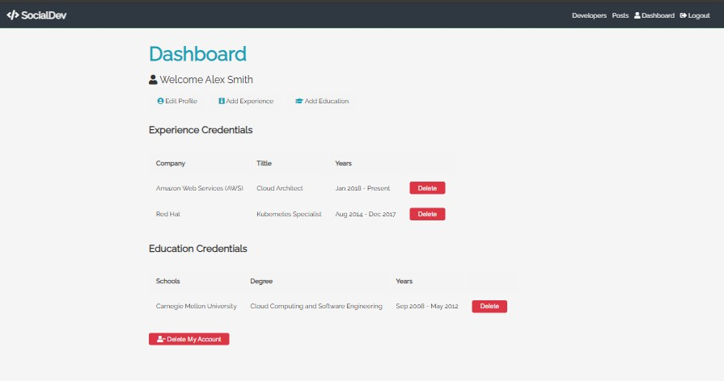
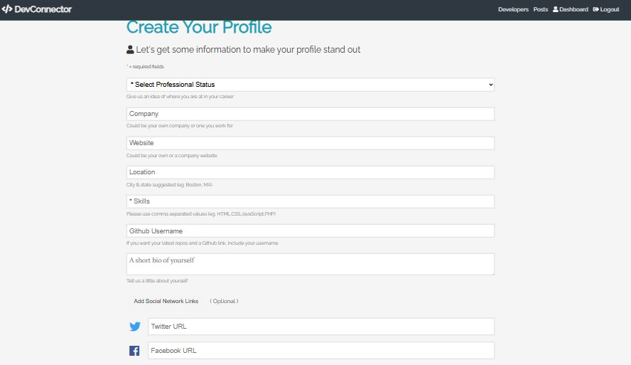
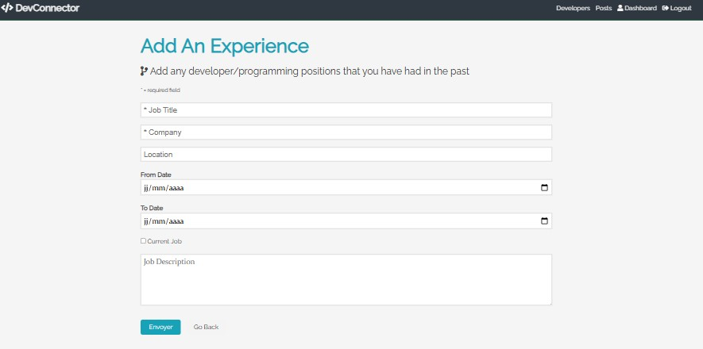
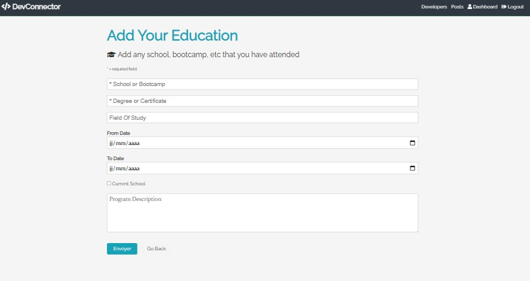
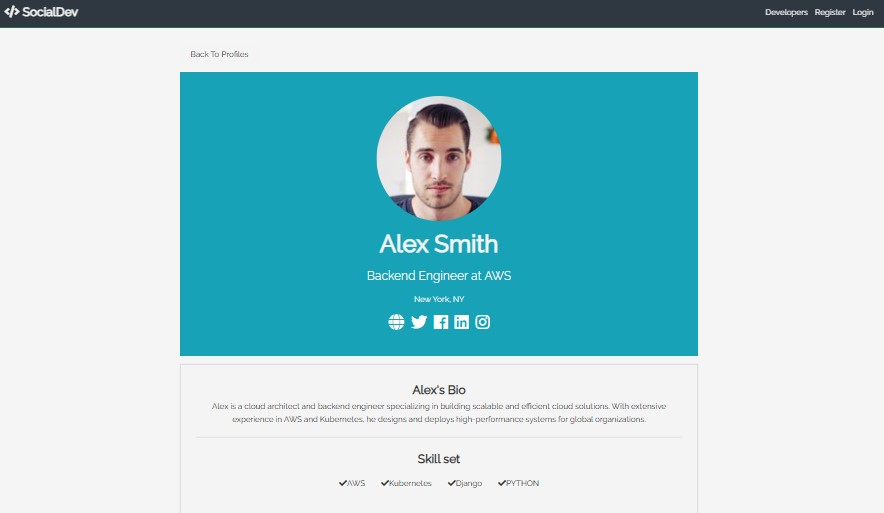
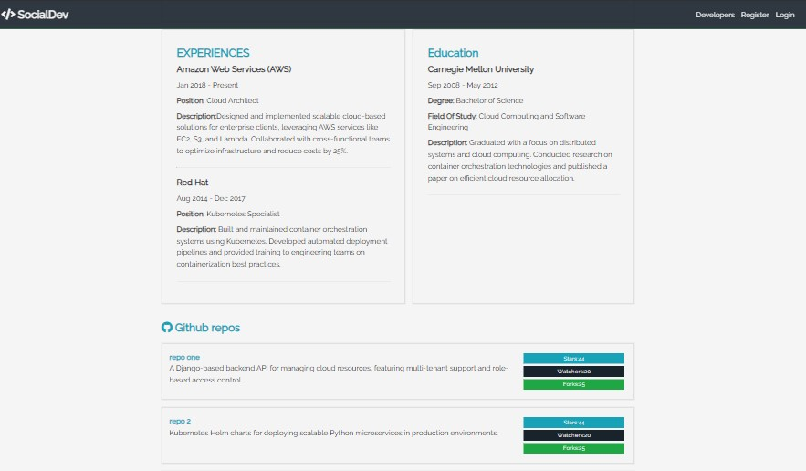

# SocialDev - README

## Description
SocialDev is a Frontend platform designed to connect developers worldwide. It allows developers to create profiles, showcase their skills, share portfolios, and collaborate with others. The application provides features such as registration, login, profile creation, and management, as well as integration with GitHub to display repositories.

---

## Features

### 1. **Landing Page**
   - A visually engaging landing page introducing the platform's purpose and features.
   

### 2. **Registration Page**
   - Allows new users to sign up using their email and create a secure account.
   

### 3. **Login Page**
   - Secure login for returning users with credential validation.
   

### 4. **Developers Listing**
   - A directory showcasing all registered developers, including their skills and profiles.
   

### 5. **Dashboard**
   - A personalized dashboard for each user to manage their experiences, education, and profile settings.
   

### 6. **Add Profile, Experience, and Education**
   - Allows users to add professional details like their job experiences and education.
   
   
   

### 7. **Profile Display**
   - Detailed view of a developer’s profile, including skills, bio, and social links.
   
   

---

## Technologies Used
- **Frontend**: HTML, Saas
- **Version Control**: Git, GitHub

---

## Installation and Setup

### Steps
1. Clone the repository:
   ```bash
   git clone https://github.com/RAZIMOUAD/socialdev.git
   ```
2. Navigate to the project directory:
   ```bash
   cd socialdev
   ```

---


## Contact
For any inquiries or support, please contact:
- **GitHub**: [MY GitHub](https://github.com/RAZIMOUAD)

